# Entity-Relationship Diagram: BioComm Copilot

**Companion to AGENT_PLAN.md §4 (agent output schemas) and §6 (shared infrastructure)**
*Scope: the persisted domain content of one memo run — therapy input, research agent outputs, critic flags, and the synthesized memo. Agent execution/orchestration state (statuses, retries, elapsed time per call) is intentionally NOT modeled here; that is owned by Langfuse per PRD.md's observability requirement.*

---

## Scope decisions

These were confirmed before modeling and shape every choice below:

1. **Persistence:** Postgres, one row set per run, persisted indefinitely. PRD.md's "no saved history" non-goal refers to the user-facing feature (no login, no browsing past memos in the UI) — not backend storage. Every run is kept server-side for debugging, Demo Day replay, and so v2 (accounts/history) doesn't require a schema rewrite.
2. **Normalization:** Fully normalized. Each research agent's array fields (trials, competitors, deals, etc.) are their own tables with foreign keys back to the run, rather than JSONB blobs.
3. **Data sharing:** Run-scoped. Every entity — including `citation`, `trial`, `approved_competitor` — belongs to exactly one `memo_run`. Two runs that reference the same NCT ID or the same approved drug get two independent rows. No cross-run identity resolution in v1.
4. **Execution tracking:** Out of scope. `agent_statuses`, retry counts, and per-call timing live in Langfuse only (Story 14). The one execution-adjacent fact that *is* domain content — total elapsed time shown to the user (Story 13) — is kept as `memo_run.elapsed_ms`.

---

## Design notes / assumptions made while modeling

- **`citation` is the single shared source-of-truth table.** Every claim that AGENT_PLAN.md's schemas attach a `source_url` / `source` / `citation` to gets a foreign key into `citation`, rather than repeating `source_url` + `access_date` as columns on every table. Where a schema field is a *list* of citations (`mechanism_of_action.citations`, `unmet_need.citations`, `endpoint_precedent.citations`), a join table is used instead of a single FK.
- **The shared `claim_label` enum** (`Fact | Assumption | Inference | Unknown`) from AGENT_PLAN.md §6.4 is implemented as one Postgres enum type reused as a column everywhere a claim needs a label — not a lookup table, since it has no independent identity.
- **Singleton per-run fields with no citation dependency** (market crowding assessment, differentiation potential, development timeline estimate, deal "no comp found" state, critic's overall flag summary) are folded directly onto `memo_run` as columns rather than given their own 1:1 tables — they're narrative extensions of the run, not independently addressable entities.
- **Singleton per-run fields that DO need a citation** (mechanism of action, patient population estimate, unmet need) are kept as their own small tables (`mechanism_of_action`, `patient_population_estimate`, `unmet_need`). Folding these into `memo_run` would have required `memo_run` to hold a nullable FK into `citation`, while `citation` also FKs back to `memo_run` — a needless cycle. Giving each its own row avoids that.
- **`guidance_document` has no `citation_id`.** Per its schema (`{ title, url, relevance }`) it *is* the source, not a claim referencing one — modeling it as a citation-consumer would be circular.
- **`endpoint_precedent.sourced_from_labels`** (a list of drug names in AGENT_PLAN.md's schema) is normalized to a join against `prior_approval` rather than stored as a text array, since `prior_approval` already models "drug + approval date + source" as a first-class entity and duplicating drug names as free text would let the two drift out of sync.
- **`decision_summary` is kept as its own 1:1 table**, not folded into `memo_run`, because it's a distinct product concept with its own UI component (Story 3) and its own acceptance criteria — worth keeping addressable on its own.
- **No `memo_section` table.** Story 10 requires an as-of date "at the top of each memo section," but Synthesis stamps a single as-of date at compile time (AGENT_PLAN.md §4.8) — `memo_run.as_of_date` covers this. Section ordering is a fixed, hardcoded sequence (PRODUCT_BRIEF.md's 10-section list), not data.

---

## Enumerated types

| Enum | Values |
|---|---|
| `claim_label` | `Fact`, `Assumption`, `Inference`, `Unknown` |
| `commercial_opportunity_rating` | `High`, `Medium`, `Low` |
| `recommended_next_step` | `Continue diligence`, `Gather more data`, `Do not pursue` |
| `trial_status` | `Active`, `Completed`, `Terminated`, `Recruiting` |
| `deal_type` | `license`, `acquisition` |
| `comp_strength` | `direct`, `approximate` |
| `source_type` | `clinical_trials_gov`, `pubmed`, `sec_filing`, `press_release`, `fda_label`, `fda_guidance`, `company_website`, `news`, `other` |
| `critic_flag_type` | `unsupported_claim`, `missing_competitor`, `assumption_as_fact`, `undisclosed_terms`, `stale_data`, `overconfident_regulatory`, `contradiction` |

---

## Diagram

```mermaid
erDiagram
    MEMO_RUN ||--|| DECISION_SUMMARY : produces
    MEMO_RUN ||--o{ CITATION : accumulates
    MEMO_RUN ||--|| MECHANISM_OF_ACTION : has
    MEMO_RUN ||--o{ TRIAL : found_in
    MEMO_RUN ||--o{ SAFETY_SIGNAL : found_in
    MEMO_RUN ||--o{ SIMILAR_DRUG_FAILURE : found_in
    MEMO_RUN ||--o{ APPROVED_COMPETITOR : maps
    MEMO_RUN ||--o{ LATE_STAGE_PIPELINE_ASSET : maps
    MEMO_RUN ||--o{ POSITIONING_GAP : identifies
    MEMO_RUN ||--|| PATIENT_POPULATION_ESTIMATE : has
    MEMO_RUN ||--|| UNMET_NEED : has
    MEMO_RUN ||--o{ COMPARABLE_DEAL : identifies
    MEMO_RUN ||--o{ GUIDANCE_DOCUMENT : references
    MEMO_RUN ||--o{ PRIOR_APPROVAL : references
    MEMO_RUN ||--o{ ENDPOINT_PRECEDENT : identifies
    MEMO_RUN ||--o{ CRITIC_FLAG : flagged_by

    CITATION ||--o{ TRIAL : sources
    CITATION ||--o{ SAFETY_SIGNAL : sources
    CITATION ||--o{ SIMILAR_DRUG_FAILURE : sources
    CITATION ||--o{ APPROVED_COMPETITOR : sources
    CITATION ||--o{ LATE_STAGE_PIPELINE_ASSET : sources
    CITATION ||--o{ PATIENT_POPULATION_ESTIMATE : sources
    CITATION ||--o{ COMPARABLE_DEAL : sources
    CITATION ||--o{ PRIOR_APPROVAL : sources
    CITATION ||--o{ MECHANISM_CITATION : linked_via
    CITATION ||--o{ UNMET_NEED_CITATION : linked_via
    CITATION ||--o{ ENDPOINT_PRECEDENT_CITATION : linked_via

    MECHANISM_OF_ACTION ||--o{ MECHANISM_CITATION : cites
    UNMET_NEED ||--o{ UNMET_NEED_CITATION : cites
    ENDPOINT_PRECEDENT ||--o{ ENDPOINT_PRECEDENT_CITATION : cites
    ENDPOINT_PRECEDENT ||--o{ ENDPOINT_PRECEDENT_PRIOR_APPROVAL : sourced_from
    PRIOR_APPROVAL ||--o{ ENDPOINT_PRECEDENT_PRIOR_APPROVAL : supports

    MEMO_RUN {
        uuid id PK
        text target
        text modality
        text stage
        text indication
        text context
        date as_of_date
        int elapsed_ms
        timestamptz generated_at
        timestamptz created_at
        text langfuse_session_id
        text market_crowding_summary
        bool market_crowding_consistent
        text differentiation_summary
        claim_label differentiation_label
        text development_timeline_summary
        claim_label development_timeline_label
        bool no_comp_found
        text no_comp_explanation
        bool has_critical_flags
        text reviewer_notes_summary
    }

    DECISION_SUMMARY {
        uuid id PK
        uuid memo_run_id FK
        commercial_opportunity_rating commercial_opportunity
        numeric confidence_score
        int key_risks_count
        int comparable_deals_found_count
        recommended_next_step recommended_next_step
    }

    CITATION {
        uuid id PK
        uuid memo_run_id FK
        source_type source_type
        text source_url
        text external_id
        date accessed_date
        date published_date
    }

    MECHANISM_OF_ACTION {
        uuid id PK
        uuid memo_run_id FK
        text summary
        claim_label label
    }

    MECHANISM_CITATION {
        uuid mechanism_of_action_id FK
        uuid citation_id FK
    }

    TRIAL {
        uuid id PK
        uuid memo_run_id FK
        uuid citation_id FK
        text nct_id
        text title
        text phase
        trial_status status
        date status_as_of_date
        text sponsor
        int enrollment
        text primary_endpoint
        bool is_stale
    }

    SAFETY_SIGNAL {
        uuid id PK
        uuid memo_run_id FK
        uuid citation_id FK
        text description
        claim_label label
    }

    SIMILAR_DRUG_FAILURE {
        uuid id PK
        uuid memo_run_id FK
        uuid citation_id FK
        text drug
        text reason_for_failure
        claim_label label
    }

    APPROVED_COMPETITOR {
        uuid id PK
        uuid memo_run_id FK
        uuid citation_id FK
        text drug
        text company
        text mechanism
        date approval_date
    }

    LATE_STAGE_PIPELINE_ASSET {
        uuid id PK
        uuid memo_run_id FK
        uuid citation_id FK
        text drug
        text company
        text mechanism
        text phase
        text status
    }

    POSITIONING_GAP {
        uuid id PK
        uuid memo_run_id FK
        text description
        claim_label label
    }

    PATIENT_POPULATION_ESTIMATE {
        uuid id PK
        uuid memo_run_id FK
        uuid citation_id FK
        text value
        claim_label label
    }

    UNMET_NEED {
        uuid id PK
        uuid memo_run_id FK
        text summary
    }

    UNMET_NEED_CITATION {
        uuid unmet_need_id FK
        uuid citation_id FK
    }

    COMPARABLE_DEAL {
        uuid id PK
        uuid memo_run_id FK
        uuid citation_id FK
        text asset
        text company
        text stage_at_deal
        deal_type deal_type
        text disclosed_terms
        comp_strength comp_strength
    }

    GUIDANCE_DOCUMENT {
        uuid id PK
        uuid memo_run_id FK
        text title
        text url
        text relevance
    }

    PRIOR_APPROVAL {
        uuid id PK
        uuid memo_run_id FK
        uuid citation_id FK
        text drug
        date approval_date
    }

    ENDPOINT_PRECEDENT {
        uuid id PK
        uuid memo_run_id FK
        text endpoint
    }

    ENDPOINT_PRECEDENT_CITATION {
        uuid endpoint_precedent_id FK
        uuid citation_id FK
    }

    ENDPOINT_PRECEDENT_PRIOR_APPROVAL {
        uuid endpoint_precedent_id FK
        uuid prior_approval_id FK
    }

    CRITIC_FLAG {
        uuid id PK
        uuid memo_run_id FK
        critic_flag_type type
        text section
        text description
    }
```

---

## Coverage check against AGENT_PLAN.md §4 schemas

| Agent | Schema field | Modeled as |
|---|---|---|
| Clinical | `trials[]` | `trial` |
| Clinical | `mechanism_of_action` | `mechanism_of_action` + `mechanism_citation` |
| Clinical | `safety_signals[]` | `safety_signal` |
| Clinical | `similar_drug_failures[]` | `similar_drug_failure` |
| Competitive | `approved_competitors[]` | `approved_competitor` |
| Competitive | `late_stage_pipeline[]` | `late_stage_pipeline_asset` |
| Competitive | `positioning_gaps[]` | `positioning_gap` |
| Commercial | `patient_population_estimate` | `patient_population_estimate` |
| Commercial | `unmet_need` | `unmet_need` + `unmet_need_citation` |
| Commercial | `market_crowding_assessment` | `memo_run.market_crowding_*` |
| Commercial | `differentiation_potential` | `memo_run.differentiation_*` |
| Deal Comparables | `comparable_deals[]` | `comparable_deal` |
| Deal Comparables | `no_comp_found` / `no_comp_explanation` | `memo_run.no_comp_*` |
| Regulatory | `guidance_documents[]` | `guidance_document` |
| Regulatory | `endpoint_precedent[]` | `endpoint_precedent` + 2 join tables |
| Regulatory | `prior_approvals_same_mechanism[]` | `prior_approval` |
| Regulatory | `development_timeline_estimate` | `memo_run.development_timeline_*` |
| Critic | `flags[]` | `critic_flag` |
| Critic | `has_critical_flags` | `memo_run.has_critical_flags` |
| Synthesis | Decision Summary | `decision_summary` |
| Synthesis | as-of dates, disclaimer | `memo_run.as_of_date` (disclaimer is static UI copy, not data) |

Every array and object field from the five research agents, the Critic, and the Synthesis Decision Summary in AGENT_PLAN.md §4 has a home. Nothing was added beyond what those schemas already specify.

---

*Open item: the hardcoded "major UC competitor" reference list (AGENT_PLAN.md §5.2) is Critic Agent config, not per-run data — it should live in the versioned config file AGENT_PLAN.md recommends, not a database table, since it's compared against but not itself part of any one run's output.*
