# Entity-Relationship Diagram: BioComm Copilot

**Companion to AGENT_PLAN.md §4 (agent output schemas) and §6 (shared infrastructure)**
*Scope: the persisted domain content of one memo run — therapy input, research agent outputs, critic flags, and the synthesized memo. Agent execution/orchestration state (statuses, retries, elapsed time per call) is intentionally NOT modeled here; that is owned by Langfuse per PRD.md's observability requirement.*

---

## Scope decisions

These were confirmed before modeling and shape every choice below:

1. **Persistence:** Postgres, one row set per run, persisted indefinitely. PRD.md's "no saved history" non-goal refers to the user-facing feature (no login, no browsing past memos in the UI) — not backend storage. Every run is kept server-side for debugging, Demo Day replay, and so v2 (accounts/history) doesn't require a schema rewrite.
2. **Normalization:** Fully normalized. Each research agent's array fields (trials, competitors, deals, etc.) are their own tables with foreign keys back to the run, rather than JSONB blobs.
3. **Data sharing:** Run-scoped. Every entity — including `citation`, `trial`, `approved_competitor` — belongs to exactly one `memo_run`. Two runs that reference the same NCT ID or the same approved drug get two independent rows. No cross-run identity resolution in v1.
4. **Execution tracking:** Out of scope. `agent_statuses`, retry counts, and per-call timing live in Langfuse only (Story 14). The one execution-adjacent fact that *is* domain content — total elapsed time shown to the user (Story 13) — is kept as `memo_run.elapsed_ms`.

---

## Design notes / assumptions made while modeling

- **`citation` is the single shared source-of-truth table.** Every claim that AGENT_PLAN.md's schemas attach a `source_url` / `source` / `citation` to gets a foreign key into `citation`, rather than repeating `source_url` + `access_date` as columns on every table. Where a schema field is a *list* of citations (`mechanism_of_action.citations`, `unmet_need.citations`, `endpoint_precedent.citations`), a join table is used instead of a single FK.
- **The shared `claim_label` enum** (`Fact | Assumption | Inference | Unknown`) from AGENT_PLAN.md §6.4 is implemented as one Postgres enum type reused as a column everywhere a claim needs a label — not a lookup table, since it has no independent identity.
- **One consistent rule for table vs. column:** a research agent's *singleton* narrative fields (one value per run, no independent identity or lifecycle) are folded directly onto `memo_run` as columns — regardless of whether they carry a citation. Earlier drafts of this ERD split singleton fields into their own tables whenever they had a citation (`mechanism_of_action`, `patient_population_estimate`, `unmet_need`) while folding citation-less ones (`market_crowding_assessment`, `differentiation_potential`) straight into `memo_run` — that was an inconsistent rule (whether something is a "real entity" shouldn't depend on whether it happens to cite a source). All singleton fields are now columns on `memo_run`; citation links for multi-citation fields (`mechanism_of_action`, `unmet_need`) are plain join tables keyed on `memo_run_id` + `citation_id`, and the single-citation case (`patient_population`) is a nullable FK column directly on `memo_run` — a standard, safe pattern, not a problematic cycle.
- **`guidance_document` has no `citation_id`.** Per its schema (`{ title, url, relevance }`) it *is* the source, not a claim referencing one — modeling it as a citation-consumer would be circular.
- **`endpoint_precedent.sourced_from_labels` is a plain text list, not a foreign key.** AGENT_PLAN.md's schema defines it as `[drug names]`. An earlier draft normalized this into a join against `prior_approval`, requiring the two independently-produced lists to match drug-name strings exactly at insert time — LLM-generated text ("Ustekinumab" vs. "Ustekinumab (Stelara)") won't reliably satisfy that. A plain text array avoids a fragile integrity requirement the source data can't guarantee.
- **`decision_summary` is kept as its own 1:1 table**, not folded into `memo_run`, because it's a distinct product concept with its own UI component (Story 3) and its own acceptance criteria — this is different from the research-agent singleton fields above, which are individual fields *within* one agent's output rather than a whole agent's top-level result.
- **`key_risk` and `route_recommendation` fill a gap in AGENT_PLAN.md itself.** PRD.md's Full Memo Output list and PRODUCT_BRIEF.md's 10-section structure both require a "Key Risks" section (#7) and a "Preliminary Route Recommendations" section (#8), and PRD.md / Story 3 require a "Key Risks" count on the Decision Summary — but none of AGENT_PLAN.md's 8 agent schemas (§4) actually define where this content comes from. These two tables give both sections a home; `decision_summary.key_risks_count` is `count(key_risk)` for the run.
- **`decision_summary` now stores the confidence formula's components, not just the final number.** AGENT_PLAN.md §5.1 defines a 5-part weighted formula and explicitly says the methodology should be visible as a footnote so a BD professional can sanity-check the score — that requires storing the components, not just the aggregate.
- **No `memo_section` table.** Story 10 requires an as-of date "at the top of each memo section," but Synthesis stamps a single as-of date at compile time (AGENT_PLAN.md §4.8) — `memo_run.as_of_date` covers this. Section ordering is a fixed, hardcoded sequence (PRODUCT_BRIEF.md's 10-section list), not data.
- **`memo_run.as_of_date`, `elapsed_ms`, and `generated_at` are nullable.** These are Synthesis Agent outputs (AGENT_PLAN.md §4.8) — a run only has them once a memo has actually been generated. A freshly created run (Story 1, before the Orchestrator has done anything) legitimately has none of the three yet; treating them as required would force fake placeholder values into the row at creation time.

---

## Enumerated types

| Enum | Values |
|---|---|
| `claim_label` | `Fact`, `Assumption`, `Inference`, `Unknown` |
| `commercial_opportunity_rating` | `High`, `Medium`, `Low` |
| `recommended_next_step` | `Continue diligence`, `Gather more data`, `Do not pursue` |
| `trial_status` | `Active`, `Completed`, `Terminated`, `Recruiting` |
| `deal_type` | `license`, `acquisition` |
| `comp_strength` | `direct`, `approximate` |
| `source_type` | `clinical_trials_gov`, `pubmed`, `sec_filing`, `press_release`, `fda_label`, `fda_guidance`, `company_website`, `news`, `conference_abstract`, `market_report`, `analyst_coverage`, `approval_letter`, `licensing_announcement`, `other` |
| `critic_flag_type` | `unsupported_claim`, `missing_competitor`, `assumption_as_fact`, `undisclosed_terms`, `stale_data`, `overconfident_regulatory`, `contradiction` |

---

## Diagram

```mermaid
erDiagram
    MEMO_RUN ||--|| DECISION_SUMMARY : produces
    MEMO_RUN ||--o{ CITATION : accumulates
    MEMO_RUN ||--o{ TRIAL : found_in
    MEMO_RUN ||--o{ SAFETY_SIGNAL : found_in
    MEMO_RUN ||--o{ SIMILAR_DRUG_FAILURE : found_in
    MEMO_RUN ||--o{ APPROVED_COMPETITOR : maps
    MEMO_RUN ||--o{ LATE_STAGE_PIPELINE_ASSET : maps
    MEMO_RUN ||--o{ POSITIONING_GAP : identifies
    MEMO_RUN ||--o{ COMPARABLE_DEAL : identifies
    MEMO_RUN ||--o{ GUIDANCE_DOCUMENT : references
    MEMO_RUN ||--o{ PRIOR_APPROVAL : references
    MEMO_RUN ||--o{ ENDPOINT_PRECEDENT : identifies
    MEMO_RUN ||--o{ CRITIC_FLAG : flagged_by
    MEMO_RUN ||--o{ KEY_RISK : identifies
    MEMO_RUN ||--o{ ROUTE_RECOMMENDATION : suggests
    MEMO_RUN ||--o{ MECHANISM_CITATION : cites
    MEMO_RUN ||--o{ UNMET_NEED_CITATION : cites

    CITATION ||--o{ TRIAL : sources
    CITATION ||--o{ SAFETY_SIGNAL : sources
    CITATION ||--o{ SIMILAR_DRUG_FAILURE : sources
    CITATION ||--o{ APPROVED_COMPETITOR : sources
    CITATION ||--o{ LATE_STAGE_PIPELINE_ASSET : sources
    CITATION ||--o{ COMPARABLE_DEAL : sources
    CITATION ||--o{ PRIOR_APPROVAL : sources
    CITATION ||--o{ KEY_RISK : sources
    CITATION ||--o{ MECHANISM_CITATION : linked_via
    CITATION ||--o{ UNMET_NEED_CITATION : linked_via
    CITATION ||--o{ ENDPOINT_PRECEDENT_CITATION : linked_via
    CITATION |o--o{ MEMO_RUN : "sources patient population estimate for"

    ENDPOINT_PRECEDENT ||--o{ ENDPOINT_PRECEDENT_CITATION : cites

    MEMO_RUN {
        uuid id PK
        text target
        text modality
        text stage
        text indication
        text context
        date as_of_date
        int elapsed_ms
        timestamptz generated_at
        timestamptz created_at
        text langfuse_session_id
        text mechanism_summary
        claim_label mechanism_label
        text patient_population_value
        claim_label patient_population_label
        uuid patient_population_citation_id FK
        text unmet_need_summary
        text market_crowding_summary
        bool market_crowding_consistent
        text differentiation_summary
        claim_label differentiation_label
        text development_timeline_summary
        claim_label development_timeline_label
        bool no_comp_found
        text no_comp_explanation
        bool has_critical_flags
        text reviewer_notes_summary
    }

    DECISION_SUMMARY {
        uuid id PK
        uuid memo_run_id FK
        commercial_opportunity_rating commercial_opportunity
        numeric confidence_score
        numeric clinical_data_completeness
        numeric competitive_coverage_completeness
        numeric commercial_source_quality
        numeric regulatory_precedent_strength
        numeric inverse_critic_flag_severity
        int key_risks_count
        int comparable_deals_found_count
        recommended_next_step recommended_next_step
    }

    CITATION {
        uuid id PK
        uuid memo_run_id FK
        source_type source_type
        text source_url
        text external_id
        date accessed_date
        date published_date
    }

    MECHANISM_CITATION {
        uuid memo_run_id FK
        uuid citation_id FK
    }

    TRIAL {
        uuid id PK
        uuid memo_run_id FK
        uuid citation_id FK
        text nct_id
        text title
        text phase
        trial_status status
        date status_as_of_date
        text sponsor
        int enrollment
        text primary_endpoint
        bool is_stale
    }

    SAFETY_SIGNAL {
        uuid id PK
        uuid memo_run_id FK
        uuid citation_id FK
        text description
        claim_label label
    }

    SIMILAR_DRUG_FAILURE {
        uuid id PK
        uuid memo_run_id FK
        uuid citation_id FK
        text drug
        text reason_for_failure
        claim_label label
    }

    APPROVED_COMPETITOR {
        uuid id PK
        uuid memo_run_id FK
        uuid citation_id FK
        text drug
        text company
        text mechanism
        date approval_date
    }

    LATE_STAGE_PIPELINE_ASSET {
        uuid id PK
        uuid memo_run_id FK
        uuid citation_id FK
        text drug
        text company
        text mechanism
        text phase
        text status
    }

    POSITIONING_GAP {
        uuid id PK
        uuid memo_run_id FK
        text description
        claim_label label
    }

    UNMET_NEED_CITATION {
        uuid memo_run_id FK
        uuid citation_id FK
    }

    COMPARABLE_DEAL {
        uuid id PK
        uuid memo_run_id FK
        uuid citation_id FK
        text asset
        text company
        text stage_at_deal
        deal_type deal_type
        text disclosed_terms
        comp_strength comp_strength
    }

    GUIDANCE_DOCUMENT {
        uuid id PK
        uuid memo_run_id FK
        text title
        text url
        text relevance
    }

    PRIOR_APPROVAL {
        uuid id PK
        uuid memo_run_id FK
        uuid citation_id FK
        text drug
        date approval_date
    }

    ENDPOINT_PRECEDENT {
        uuid id PK
        uuid memo_run_id FK
        text endpoint
        text_array sourced_from_labels
    }

    ENDPOINT_PRECEDENT_CITATION {
        uuid endpoint_precedent_id FK
        uuid citation_id FK
    }

    CRITIC_FLAG {
        uuid id PK
        uuid memo_run_id FK
        critic_flag_type type
        text section
        text description
    }

    KEY_RISK {
        uuid id PK
        uuid memo_run_id FK
        uuid citation_id FK
        text description
        claim_label label
    }

    ROUTE_RECOMMENDATION {
        uuid id PK
        uuid memo_run_id FK
        text description
        claim_label label
    }
```

---

## Coverage check against AGENT_PLAN.md §4 schemas

| Agent | Schema field | Modeled as |
|---|---|---|
| Clinical | `trials[]` | `trial` |
| Clinical | `mechanism_of_action` | `memo_run.mechanism_summary` / `.mechanism_label` + `mechanism_citation` |
| Clinical | `safety_signals[]` | `safety_signal` |
| Clinical | `similar_drug_failures[]` | `similar_drug_failure` |
| Competitive | `approved_competitors[]` | `approved_competitor` |
| Competitive | `late_stage_pipeline[]` | `late_stage_pipeline_asset` |
| Competitive | `positioning_gaps[]` | `positioning_gap` |
| Commercial | `patient_population_estimate` | `memo_run.patient_population_value` / `.patient_population_label` / `.patient_population_citation_id` |
| Commercial | `unmet_need` | `memo_run.unmet_need_summary` + `unmet_need_citation` |
| Commercial | `market_crowding_assessment` | `memo_run.market_crowding_*` |
| Commercial | `differentiation_potential` | `memo_run.differentiation_*` |
| Deal Comparables | `comparable_deals[]` | `comparable_deal` |
| Deal Comparables | `no_comp_found` / `no_comp_explanation` | `memo_run.no_comp_*` |
| Regulatory | `guidance_documents[]` | `guidance_document` |
| Regulatory | `endpoint_precedent[]` | `endpoint_precedent` (+ `sourced_from_labels` text array, + `endpoint_precedent_citation`) |
| Regulatory | `prior_approvals_same_mechanism[]` | `prior_approval` |
| Regulatory | `development_timeline_estimate` | `memo_run.development_timeline_*` |
| Critic | `flags[]` | `critic_flag` |
| Critic | `has_critical_flags` | `memo_run.has_critical_flags` |
| Synthesis | Decision Summary | `decision_summary` (incl. confidence sub-scores) |
| Synthesis | as-of dates, disclaimer | `memo_run.as_of_date` (disclaimer is static UI copy, not data) |
| *(gap in AGENT_PLAN.md, not any one agent)* | "Key Risks" memo section | `key_risk` |
| *(gap in AGENT_PLAN.md, not any one agent)* | "Preliminary Route Recommendations" memo section | `route_recommendation` |

Every array and object field from the five research agents, the Critic, and the Synthesis Decision Summary in AGENT_PLAN.md §4 has a home, plus the two memo sections (Key Risks, Route Recommendations) that PRD.md/PRODUCT_BRIEF.md require but that AGENT_PLAN.md's agent schemas never actually defined.

---

*Open item: the hardcoded "major UC competitor" reference list (AGENT_PLAN.md §5.2) is Critic Agent config, not per-run data — it should live in the versioned config file AGENT_PLAN.md recommends, not a database table, since it's compared against but not itself part of any one run's output.*

*Open item: AGENT_PLAN.md itself should be updated to specify which agent (or Synthesis, cross-referencing all five research outputs) produces the Key Risks and Route Recommendations content — the ERD gives both a home, but the generation logic isn't yet specified anywhere in the product docs.*
